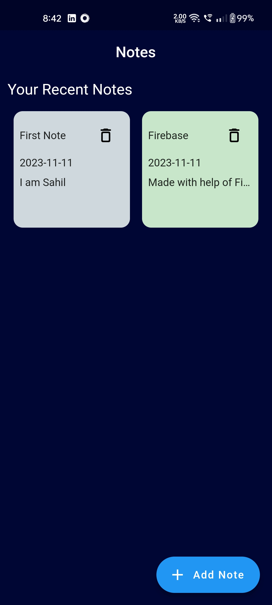
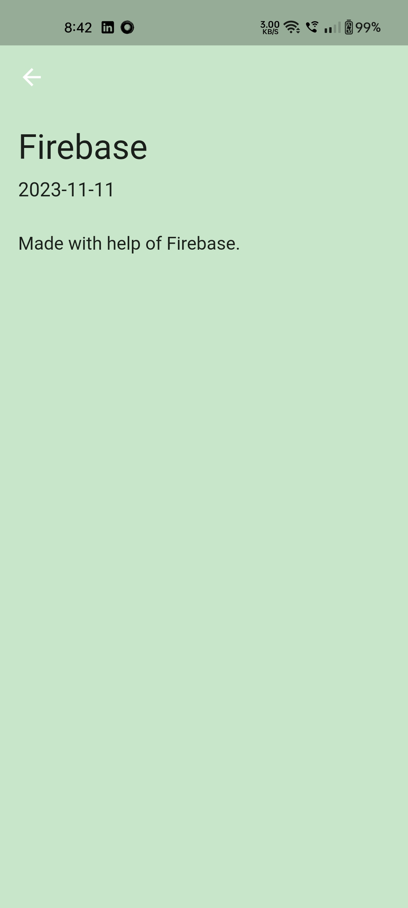
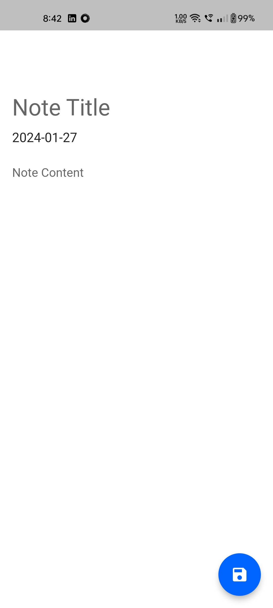

# MyNotes

## Table of contents

- [Screenshot](#screenshot)
- [Description](#description)
- [Built with](#built-with)
- [What I learned](#what-i-learned)
- [Author](#author)

## Description

A Notes App which has a Backend. The user can write down his thoughts or other stuff he wants to write down. The notes are in an Grid View with different colors which enhance the appearance of the app.

### Screenshot

### Built with

- Flutter
- Cloud Firestore

### What I learned

I learned about how to enhance the user's experience i.e. by using grid view and using different colors.

## Author

- LinkedIn - [Sahil Bansal] (https://www.linkedin.com/in/%F0%9F%8E%AF-sahil-bansal-882b41272/)
- Twitter - [@Sahil121315](https://x.com/Sahil121315?t=91yHYBDE2vjBnehGdAjZ0Q&s=09)
